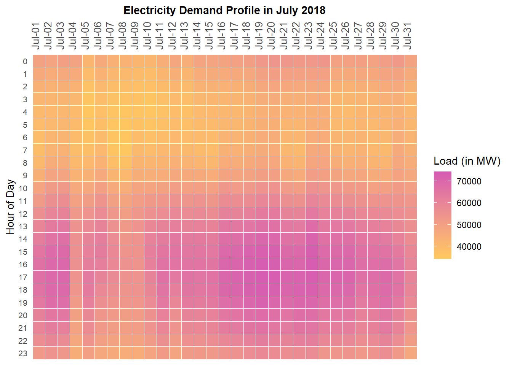

```{r setup, include=FALSE}
knitr::opts_chunk$set(echo = FALSE)
```

## Introduction/Background
- Data is from Electric Reliability Council of Texas (ERCOT)
  - Manages the flow of electricity power and represents over 90% of the state's electric load
- Our focus is to predict the next 24 hour load based on past historical data
```{r}
library(png)
library(grid)
img <- readPNG("ercotwebsite.png")
grid.raster(img)
```
- GOAL: Predict the next 24 hour load using past history of demands


## Data Exploration 

```{r}
img <- readPNG("README-electricity graph-1.png")
grid.raster(img)
```

A peak around the summer time; noticeable trend

Texas has a similar climate to Illinois. High energy usage in summers and winters.

## Load in Spring(March) vs Load in Summer(July)  
{ width=49% } { width=49% }

Relatively low energy consumption in the mornings, high in the afternoons and evenings

Very hot in the summer = a lot air conditioners in use, everyday looks very similar

## Prediction Strategy
- 3 features: Load at hour t from the exact moment 7 days, 2 days and 1 day ago 

- Split data in train (284 days) and test (72 days) set

- Predict Demand at Hour t, $t \in \left \{0,1,2...23 \right \}$
$$ Demand_{t}=\beta_{0}+\beta_{1} \text {7days ago}_{t}+\beta_{2} \text {2days ago }_{t}+\beta_{3} \text { 1day ago}_{t} + \epsilon$$
- In total: 24 regression models for each hour of a day

## Results & Room for Improvement
Testing Acc: 81% ; Could be better if used non-linear methods (NN, ARIMA)
{ width=74% }
