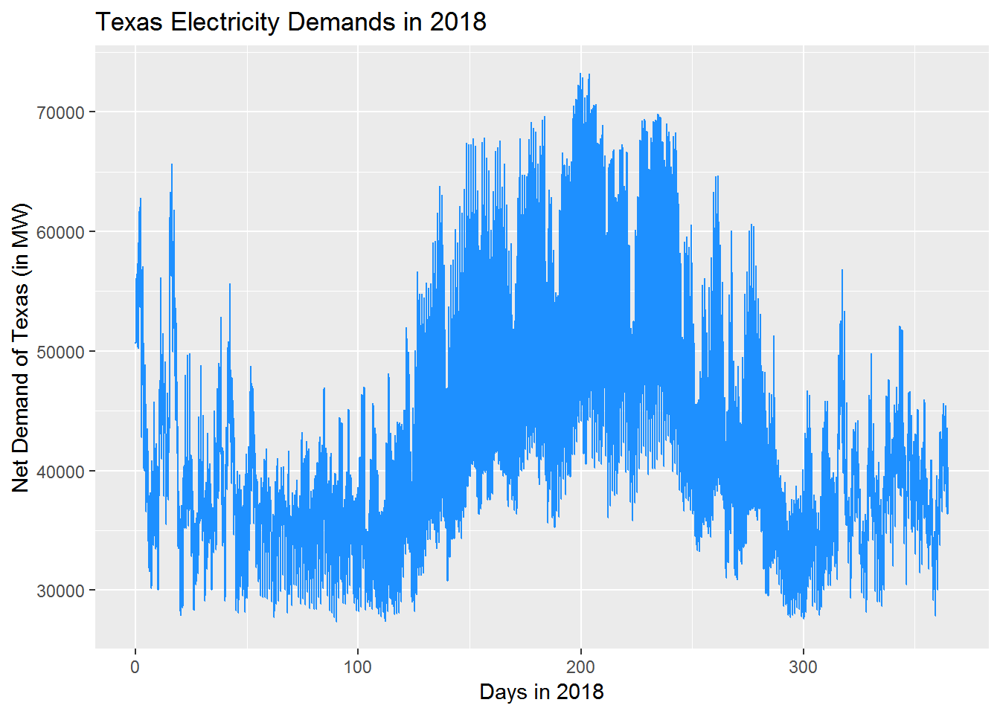
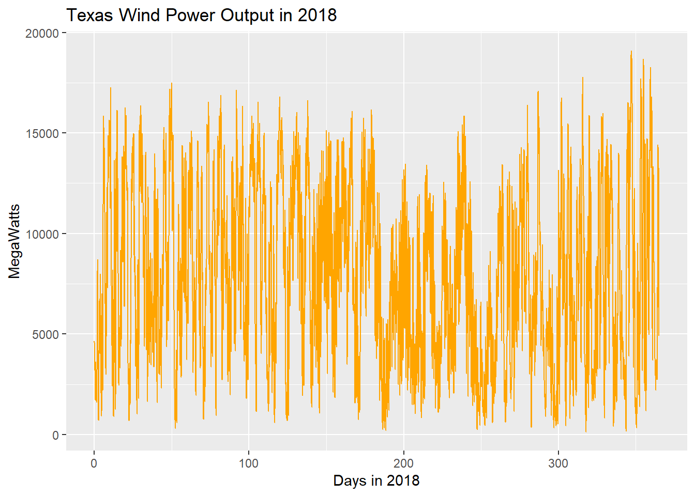

<!-- README.md is generated from README.Rmd. Please edit that file -->
Electricity Load Prediction in Texas
====================================

predict 24 hour load using past history of demands with statistical methods

identify how wind energy affects energy forecasting

data visualizations

Introduction
------------

But why is it important to predict hourly demand for electricity at least a day in advance? You need to know much generators needs to be on to meet the expected demand and turning on a generator requires time.

Libraries/packages we will be using
-----------------------------------

``` r
library(ggplot2)
```

Load the ERCOT 2018 data
------------------------

``` r
dfDemand = read.csv("ERCOT_2018_Hourly_Wind_Output.csv")
demands = dfDemand$ERCOT.Load..MW
numberOfDays = length(demands)/24
```

Let's see how does load vary over the year in Texas.

``` r
days = vector(length = numberOfDays * 24)
for (hour in seq_len(numberOfDays * 24)) {
  days[hour] = hour / 24 
}

ggplot(dfDemand, aes(x = days, y = demands)) + geom_line(color = "dodgerblue") + 
  labs(title = "Texas Electricity Demands in 2018", x = "Days in 2018", y = "Net Demand of Texas (in MW)") 
```



Wind data

``` r
dfDemand$Windless_Load = dfDemand$ERCOT.Load..MW - dfDemand$Total.Wind.Output..MW
windDemand = dfDemand$Windless_Load
windOutput = dfDemand$Total.Wind.Output..MW

ggplot(dfDemand, aes(x = days, y = windOutput)) + geom_line(color = "orange") + 
  labs(title = "Texas Wind Power Output in 2018", x = "Days in 2018", y = "MegaWatts")
```



Wind Power looks very sporadic while electricity demands seems to have a trend.

Prediction
----------
